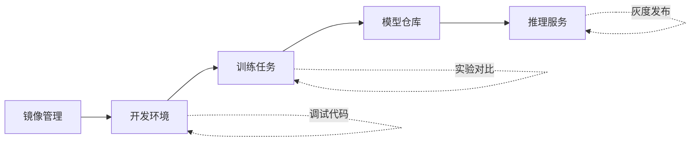

# AI 工作负载模块使用指南

## 📋 模块概览

费米集群平台的 AI 工作负载分为三个核心模块，每个模块针对不同的使用场景和用户需求：

| 模块 | 定位 | 图标 | 适用场景 | 用户角色 |
|------|------|------|----------|----------|
| **开发环境** | 交互式容器实例 | 🖥️ Terminal | 代码开发、调试实验 | 数据科学家、研发人员 |
| **训练任务** | 批处理训练作业 | ⚡ Zap | 模型训练、超参调优 | 算法工程师、ML工程师 |
| **推理服务** | 在线API服务 | 🚀 Rocket | 生产部署、API服务 | 应用开发者、运维人员 |

---

## 🖥️ 一、开发环境 (Instances)

### 定位
类似于云服务器或虚拟机的**长期运行容器环境**，提供完全的交互式访问。

### 核心特点
- ✅ **交互式访问** - 可以通过终端、Jupyter Notebook 等方式直接操作
- ✅ **长期运行** - 按需启动和停止，适合持续开发工作
- ✅ **灵活配置** - 自由选择镜像、资源、启动命令
- ✅ **手动管理** - 用户完全控制实例的生命周期

### 典型使用场景
- 🔬 **数据探索分析** - 使用 Jupyter Notebook 进行数据分析
- 💻 **代码开发调试** - 在真实 GPU 环境中开发和调试代码
- 🧪 **临时实验** - 快速测试想法和算法原型
- 📊 **可视化工作** - 运行 TensorBoard 等可视化工具
- 🛠️ **环境配置** - 安装依赖、调试环境问题

### 使用流程

```
1. 选择实例类型
   ├─ 训练任务类型 → 预配置训练环境
   ├─ 推理服务类型 → 预配置推理环境
   ├─ Notebook类型 → Jupyter Lab 环境
   └─ 自定义类型 → 完全自定义

2. 选择镜像
   前往"镜像管理"选择或创建镜像
   
3. 配置资源
   ├─ GPU 数量 (0-8卡)
   ├─ CPU 核心 (4-128核)
   ├─ 内存大小 (16GB-1TB)
   └─ 存储空间 (50GB-2TB)
   
4. 配置网络 (可选)
   └─ 暴露端口 (Jupyter:8888, TensorBoard:6006等)
   
5. 高级配置 (可选)
   ├─ 环境变量
   ├─ 启动命令
   └─ 自动重启策略
   
6. 创建并启动实例

7. 连接使用
   ├─ Web 终端
   ├─ Jupyter Lab
   ├─ SSH 连接
   └─ 端口访问
```

### 费用计算
按**实际运行时间**计费，停止后不计费。

---

## ⚡ 二、训练任务 (Training Jobs)

### 定位
专门为**深度学习模型训练**设计的批处理任务管理系统。

### 核心特点
- ✅ **任务式管理** - 有明确的开始和结束，自动化执行
- ✅ **实验追踪** - 自动记录超参数、指标、产出模型
- ✅ **分布式支持** - 原生支持多机多卡分布式训练
- ✅ **断点续传** - 支持训练中断后从检查点恢复
- ✅ **资源调度** - 自动排队、智能调度GPU资源

### 典型使用场景
- 🎯 **大规模模型训练** - LLM、视觉大模型等训练
- 🔄 **分布式训练** - 多机多卡并行训练
- 📈 **超参数调优** - 批量实验对比和优化
- 🔁 **定期重训练** - 定时任务自动重训练模型
- 📊 **实验管理** - MLOps 工作流中的训练环节

### 使用流程

```
1. 创建训练任务
   └─ 基本信息
      ├─ 任务名称
      ├─ 任务描述
      └─ 任务标签

2. 配置训练脚本
   ├─ 代码仓库 (Git URL)
   ├─ 训练脚本路径
   └─ 启动命令
   
3. 选择训练镜像
   前往"镜像管理"选择合适的训练框架镜像
   
4. 配置计算资源
   ├─ 单机训练
   │  ├─ GPU数量
   │  ├─ CPU/内存
   │  └─ 存储
   └─ 分布式训练
      ├─ Worker节点数
      ├─ 每节点GPU数
      └─ 分布式框架 (Horovod/DeepSpeed/PyTorch DDP)
   
5. 设置超参数
   └─ 以环境变量或配置文件方式传入
   
6. 配置数据集
   ├─ 从"数据集"模块选择
   └─ 挂载路径
   
7. 输出配置
   ├─ 模型输出路径
   ├─ 日志输出路径
   └─ 自动保存到"模型仓库"
   
8. 提交训练任务

9. 监控训练进度
   ├─ 实时日志
   ├─ 资源使用率
   ├─ 训练指标曲线
   └─ TensorBoard集成
   
10. 任务完成
    ├─ 自动保存模型
    ├─ 生成训练报告
    └─ 释放计算资源
```

### 任务状态流转
```
Pending (排队中)
    ↓
Running (运行中)
    ↓
Completed (成功完成) / Failed (失败) / Stopped (手动停止)
```

### 费用计算
按**任务实际执行时间**计费，任务结束自动释放资源。

---

## 🚀 三、推理服务 (Inference Services)

### 定位
面向**生产环境**的模型推理API服务，提供高可用、高性能的在线推理能力。

### 核心特点
- ✅ **服务化部署** - 以 REST/gRPC API 形式对外提供服务
- ✅ **高可用性** - 多副本部署、健康检查、自动重启
- ✅ **自动扩缩容** - 根据负载自动调整实例数量
- ✅ **负载均衡** - 自动分发请求到多个实例
- ✅ **版本管理** - 支持灰度发布、A/B测试、流量切换
- ✅ **性能优化** - 模型加速、批处理推理、缓存

### 典型使用场景
- 🌐 **生产API服务** - 对外提供模型推理接口
- 📱 **应用集成** - App/Web应用调用AI能力
- 🔄 **实时推理** - 低延迟的在线推理需求
- 📊 **高并发服务** - 处理大量并发推理请求
- 🎯 **多版本管理** - 模型版本迭代和灰度发布

### 使用流程

```
1. 创建推理服务
   └─ 基本信息
      ├─ 服务名称
      ├─ 服务描述
      └─ 服务类型 (REST API / gRPC / WebSocket)

2. 选择模型
   ├─ 从"模型仓库"选择已训练模型
   └─ 指定模型版本
   
3. 选择推理引擎
   前往"镜像管理"选择推理服务镜像
   ├─ Triton Inference Server (多框架支持)
   ├─ vLLM (LLM专用高性能)
   ├─ TorchServe (PyTorch模型)
   ├─ TensorFlow Serving
   └─ ONNX Runtime
   
4. 配置计算资源
   ├─ GPU类型和数量
   ├─ CPU和内存
   └─ 推理批大小
   
5. 配置服务参数
   ├─ API端点路径
   ├─ 请求/响应格式
   ├─ 超时设置
   └─ 并发限制
   
6. 配置弹性伸缩
   ├─ 最小副本数
   ├─ 最大副本数
   ├─ 扩容指标 (CPU/GPU/QPS)
   └─ 扩缩容策略
   
7. 配置流量策略 (可选)
   ├─ 灰度发布比例
   ├─ A/B测试规则
   └─ 金丝雀部署
   
8. 部署服务

9. 获取访问地址
   └─ https://api.fermion.ai/inference/{service-name}
   
10. 监控服务运行
    ├─ QPS/延迟
    ├─ 成功率/错误率
    ├─ 资源使用率
    └─ 成本统计
```

### 服务状态
```
Deploying (部署中)
    ↓
Running (运行中)
    ├─ Healthy (健康)
    └─ Degraded (降级)
    ↓
Stopped (已停止) / Failed (失败)
```

### 费用计算
按**服务运行时间和副本数**计费，支持按需付费和预留实例。

---

## 🔄 三个模块的协同工作流

### 典型 AI 项目全流程



### 实际案例：大语言模型微调和部署

```
第1步：准备环境
├─ 镜像管理: 选择 PyTorch 2.1 + CUDA 12.1 镜像
└─ 开发环境: 创建 Jupyter 实例，编写微调代码

第2步：数据准备和代码调试
├─ 开发环境: 在 Jupyter 中探索数据、调试代码
├─ 数据集: 上传和预处理训练数据
└─ 开发环境: 小规模测试训练流程

第3步：大规模训练
├─ 训练任务: 提交分布式训练任务
├─ 配置: 8机64卡 A100
├─ 监控: 实时查看损失曲线和资源使用
└─ 输出: 自动保存到模型仓库

第4步：模型评估
├─ 开发环境: 创建新实例加载训练好的模型
└─ 评估: 运行评估脚本，查看指标

第5步：部署推理服务
├─ 镜像管理: 选择 vLLM 推理镜像
├─ 推理服务: 创建 API 服务
├─ 配置: 2副本，支持自动扩容
└─ 测试: 调用 API 验证功能

第6步：生产监控和迭代
├─ 推理服务: 监控 QPS、延迟、错误率
├─ 训练任务: 根据线上反馈重新训练
└─ 推理服务: 灰度发布新模型版本
```

---

## 🎯 快速选择指南

### 我应该用哪个模块？

| 你的需求 | 推荐模块 | 原因 |
|---------|---------|------|
| 我想用 Jupyter 做数据分析 | **开发环境** | 需要交互式环境 |
| 我要调试训练代码 | **开发环境** | 需要反复修改和测试 |
| 我要训练一个大模型 | **训练任务** | 自动化管理、实验追踪 |
| 我要做超参数调优实验 | **训练任务** | 支持批量任务和对比 |
| 我要部署模型API | **推理服务** | 服务化、高可用 |
| 我需要支持高并发推理 | **推理服务** | 自动扩缩容、负载均衡 |
| 我要灰度发布新模型 | **推理服务** | 版本管理、流量控制 |

---

## 📦 镜像管理模块

### 定位
统一管理所有容器镜像环境，为三大工作负载模块提供基础镜像支持。

### 镜像分类

#### 1. 官方镜像 (Official)
- 平台官方维护和验证
- 定期更新安全补丁
- 包含常用深度学习框架
- 示例：
  - `pytorch:2.1.0-cuda12.1-cudnn8-runtime`
  - `tensorflow:2.14.0-gpu`
  - `jupyter-pytorch-notebook:latest`
  - `triton-inference-server:23.10-py3`
  - `vllm-openai:v0.2.1`

#### 2. 社区镜像 (Community)
- 第三方开发者贡献
- 经过平台验证
- 满足特定场景需求
- 示例：
  - `rapids-ml:23.10`
  - `stable-diffusion-webui:latest`

#### 3. 自定义镜像 (Custom)
- 用户自己创建
- 支持两种方式：
  - 从仓库拉取
  - Dockerfile 构建

### 使用流程

```
1. 浏览镜像
   ├─ 按分类筛选 (官方/社区/自定义)
   ├─ 按框架筛选 (PyTorch/TensorFlow等)
   └─ 搜索关键词

2. 查看镜像详情
   ├─ 镜像描述和用途
   ├─ GPU/CUDA支持
   ├─ Python版本
   ├─ 预装框架和工具
   └─ 镜像大小

3. 使用镜像
   └─ 在"开发环境"、"训练任务"、"推理服务"中选择

4. 创建自定义镜像 (可选)
   ├─ 方式1: 从仓库添加
   │  ├─ 选择镜像仓库 (Docker Hub/NGC/私有仓库)
   │  ├─ 输入镜像名称和标签
   │  └─ 添加描述
   │
   └─ 方式2: Dockerfile构建
      ├─ 编写 Dockerfile
      ├─ 提交构建
      └─ 等待构建完成
```

---

## ⚠️ 重要说明

### 资源配额和限制
- 每个用户有默认的资源配额
- 开发环境和推理服务会持续占用资源
- 训练任务完成后自动释放资源
- 建议及时停止不用的开发环境

### 费用优化建议
- 开发环境：用完及时停止
- 训练任务：合理配置资源，避免浪费
- 推理服务：根据实际流量配置自动扩缩容

### 最佳实践
1. **开发环境** 用于开发和调试
2. **训练任务** 用于正式训练
3. **推理服务** 用于生产部署
4. 不要在开发环境中跑生产任务
5. 不要用推理服务进行开发调试

---

## 📞 需要帮助？

- 📚 查看详细文档
- 💬 联系技术支持
- 🎓 参加在线培训
