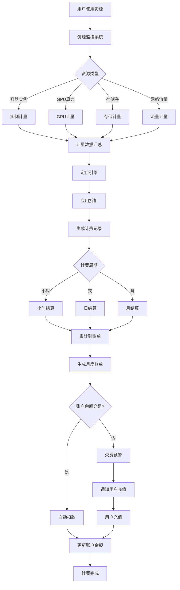

# 费米集群计费模块 - 业务流程图

## 📊 核心业务流程可视化

### 1. 计费系统全景流程



---

### 2. 资源创建到计费流程

```
┌─────────────────────────────────────────────────────────┐
│  阶段1: 资源创建                                         │
├─────────────────────────────────────────────────────────┤
│                                                          │
│  用户操作                                                │
│  ├─ 选择资源类型（实例/GPU/存储）                        │
│  ├─ 配置资源参数                                         │
│  ├─ 查看价格预估                                         │
│  └─ 确认创建                                             │
│                                                          │
│  系统处理                                                │
│  ├─ 验证账户余额                                         │
│  ├─ 创建订单记录                                         │
│  ├─ 分配资源                                             │
│  └─ 启动计量服务                                         │
│                                                          │
└─────────────────────────────────────────────────────────┘
                          ↓
┌─────────────────────────────────────────────────────────┐
│  阶段2: 资源使用                                         │
├─────────────────────────────────────────────────────────┤
│                                                          │
│  实时监控                                                │
│  ├─ 每分钟采集资源使用数据                               │
│  ├─ CPU/GPU使用率                                        │
│  ├─ 内存占用量                                           │
│  ├─ 存储空间使用                                         │
│  └─ 网络流量统计                                         │
│                                                          │
│  数据记录                                                │
│  ├─ 写入时序数据库                                       │
│  ├─ 实时聚合统计                                         │
│  └─ 触发告警（如果需要）                                 │
│                                                          │
└─────────────────────────────────────────────────────────┘
                          ↓
┌─────────────────────────────────────────────────────────┐
│  阶段3: 费用计算                                         │
├─────────────────────────────────────────────────────────┤
│                                                          │
│  周期性结算（每小时）                                    │
│  ├─ 汇总使用量数据                                       │
│  ├─ 查询定价规则                                         │
│  ├─ 计算原始费用                                         │
│  └─ 应用折扣策略                                         │
│                                                          │
│  折扣计算                                                │
│  ├─ 用户等级折扣                                         │
│  ├─ 长期使用折扣                                         │
│  ├─ 批量购买折扣                                         │
│  └─ 促销活动折扣                                         │
│                                                          │
│  生成计费记录                                            │
│  ├─ 记录ID                                               │
│  ├─ 资源信息                                             │
│  ├─ 使用量明细                                           │
│  ├─ 单价和总价                                           │
│  └─ 时间范围                                             │
│                                                          │
└─────────────────────────────────────────────────────────┘
                          ↓
┌─────────────────────────────────────────────────────────┐
│  阶段4: 账单生成                                         │
├─────────────────────────────────────────────────────────┤
│                                                          │
│  月度账单生成（每月1日）                                 │
│  ├─ 汇总所有计费记录                                     │
│  ├─ 按资源类型分类                                       │
│  ├─ 计算总费用                                           │
│  └─ 生成账单文档                                         │
│                                                          │
│  账单内容                                                │
│  ├─ 账单号                                               │
│  ├─ 计费周期                                             │
│  ├─ 费用明细                                             │
│  ├─ 总计金额                                             │
│  └─ 支付状态                                             │
│                                                          │
│  用户通知                                                │
│  ├─ 站内消息                                             │
│  ├─ 邮件通知                                             │
│  └─ 短信提醒（欠费）                                     │
│                                                          │
└─────────────────────────────────────────────────────────┘
                          ↓
┌─────────────────────────────────────────────────────────┐
│  阶段5: 支付结算                                         │
├─────────────────────────────────────────────────────────┤
│                                                          │
│  自动扣款（余额充足）                                    │
│  ├─ 检查账户余额                                         │
│  ├─ 扣减费用                                             │
│  ├─ 更新账单状态                                         │
│  └─ 生成支付凭证                                         │
│                                                          │
│  欠费处理（余额不足）                                    │
│  ├─ 标记欠费状态                                         │
│  ├─ 发送催款通知                                         │
│  ├─ 限制新资源创建                                       │
│  └─ 预警资源停止                                         │
│                                                          │
└─────────────────────────────────────────────────────────┘
```

---

### 3. 充值流程详解

```
用户端                     系统端                     支付网关
  │                         │                          │
  │  点击充值按钮            │                          │
  ├────────────────────────>│                          │
  │                         │                          │
  │  选择金额和支付方式      │                          │
  ├────────────────────────>│                          │
  │                         │                          │
  │                         │  创建充值订单            │
  │                         │  ├─ 生成订单号           │
  │                         │  ├─ 记录金额             │
  │                         │  └─ 保存支付方式         │
  │                         │                          │
  │                         │  调用支付接口            │
  │                         ├─────────────────────────>│
  │                         │                          │
  │                         │      返回支付URL         │
  │                         │<─────────────────────────┤
  │                         │                          │
  │  跳转支付页面            │                          │
  │<────────────────────────┤                          │
  │                         │                          │
  │                         │                          │
  │  用户完成支付            │                          │
  ├──────────────────────────────────────────────────>│
  │                         │                          │
  │                         │   支付成功回调           │
  │                         │<─────────────────────────┤
  │                         │                          │
  │                         │  验证回调签名            │
  │                         │  ├─ 验证订单号           │
  │                         │  ├─ 验证金额             │
  │                         │  └─ 验证状态             │
  │                         │                          │
  │                         │  更新订单状态            │
  │                         │  └─ 标记为"已支付"       │
  │                         │                          │
  │                         │  增加账户余额            │
  │                         │  ├─ 原余额 + 充值金额    │
  │                         │  ├─ 更新可用余额         │
  │                         │  └─ 记录充值流水         │
  │                         │                          │
  │  充值成功通知            │                          │
  │<────────────────────────┤                          │
  │                         │                          │
  │  返回费用中心            │                          │
  │  余额已更新              │                          │
  │                         │                          │
```

---

### 4. 发票申请流程

```
┌──────────┐
│  用户端   │
└────┬─────┘
     │
     │ 1. 打开发票管理页面
     │    查看可开票金额
     ▼
┌──────────────────┐
│ 填写发票申请表单 │
├──────────────────┤
│ • 发票类型       │
│ • 抬头信息       │
│ • 税号           │
│ • 开票金额       │
│ • 计费周期       │
│ • 邮寄地址（专票）│
└────┬─────────────┘
     │
     │ 2. 提交申请
     ▼
┌──────────────────┐
│   系统审核       │
├──────────────────┤
│ 验证项：         │
│ ✓ 税号格式正确   │
│ ✓ 开票金额合理   │
│ ✓ 可开票额度充足 │
│ ✓ 信息完整       │
└────┬─────────────┘
     │
     ├─────────┬─────────┐
     │         │         │
     ▼         ▼         ▼
  验证通过   信息不全   额度不足
     │         │         │
     │         └────┐    └────┐
     │              │         │
     │              ▼         ▼
     │         ┌─────────────────┐
     │         │   驳回申请      │
     │         │   返回原因      │
     │         └─────────────────┘
     │
     │ 3. 进入开票流程
     ▼
┌──────────────────┐
│   财务处理       │
├──────────────────┤
│ 1. 分配发票号    │
│ 2. 生成发票PDF   │
│ 3. 电子盖章      │
│ 4. 上传到服务器  │
└────┬─────────────┘
     │
     │ 4. 发票已开具
     ▼
┌──────────────────┐
│   通知用户       │
├──────────────────┤
│ • 站内消息       │
│ • 邮件通知       │
│ • 提供下载链接   │
└────┬─────────────┘
     │
     │ 5. 用户下载发票
     ▼
┌──────────────────┐
│   流程结束       │
└──────────────────┘
```

---

### 5. 政府算力券业务流程

```
┌─────────────────────────────────────────────────────────┐
│  第一阶段：项目发布                                      │
├─────────────────────────────────────────────────────────┤
│                                                          │
│  政府部门                    平台管理员                  │
│      │                           │                       │
│      │  发布算力券项目           │                       │
│      ├──────────────────────────>│                       │
│      │                           │                       │
│      │                           │  录入项目信息         │
│      │                           │  ├─ 项目名称          │
│      │                           │  ├─ 项目编号          │
│      │                           │  ├─ 最大额度          │
│      │                           │  ├─ 申请条件          │
│      │                           │  ├─ 使用范围          │
│      │                           │  └─ 截止日期          │
│      │                           │                       │
│      │  项目信息确认              │                       │
│      │<──────────────────────────┤                       │
│      │                           │                       │
│      │  批准发布                  │                       │
│      ├──────────────────────────>│                       │
│      │                           │                       │
│      │                           │  项目上线             │
│      │                           │  用户可见             │
│                                                          │
└─────────────────────────────────────────────────────────┘

┌─────────────────────────────────────────────────────────┐
│  第二阶段：用户申请                                      │
├─────────────────────────────────────────────────────────┤
│                                                          │
│  用户                         系统                       │
│   │                            │                         │
│   │  浏览可申请项目            │                         │
│   ├───────────────────────────>│                         │
│   │                            │                         │
│   │  查看项目详情              │                         │
│   │  ├─ 项目说明               │                         │
│   │  ├─ 申请条件               │                         │
│   │  └─ 所需材料               │                         │
│   │                            │                         │
│   │  填写申请表单              │                         │
│   │  ├─ 企业信息               │                         │
│   │  ├─ 项目描述               │                         │
│   │  ├─ 申请额度               │                         │
│   │  └─ 预期用途               │                         │
│   │                            │                         │
│   │  上传证明材料              │                         │
│   │  ├─ 营业执照               │                         │
│   │  ├─ 项目立项文件           │                         │
│   │  └─ 技术方案               │                         │
│   │                            │                         │
│   │  提交申请                  │                         │
│   ├───────────────────────────>│                         │
│   │                            │                         │
│   │                            │  保存申请记录           │
│   │                            │  状态：待审核           │
│   │                            │                         │
│   │  申请已提交通知            │                         │
│   │<───────────────────────────┤                         │
│                                                          │
└─────────────────────────────────────────────────────────┘

┌─────────────────────────────────────────────────────────┐
│  第三阶段：审核批准                                      │
├─────────────────────────────────────────────────────────┤
│                                                          │
│  管理员                       系统                       │
│     │                          │                         │
│     │  查看待审核列表          │                         │
│     ├─────────────────────────>│                         │
│     │                          │                         │
│     │  点击某个申请查看详情    │                         │
│     ├─────────────────────────>│                         │
│     │                          │                         │
│     │  审核材料                │                         │
│     │  ├─ 验证企业资质         │                         │
│     │  ├─ 评估项目可行性       │                         │
│     │  ├─ 确认额度合理性       │                         │
│     │  └─ 检查材料完整性       │                         │
│     │                          │                         │
│     ├──审核决定───┬───────┐   │                         │
│     │            │       │   │                         │
│     ▼            ▼       ▼   │                         │
│   通过        需补充材料  驳回│                         │
│     │            │       │   │                         │
│     │            │       │   │  更新申请状态           │
│     │            │       │   │  发送通知               │
│     │            │       │   │                         │
│     │            │       └──>│  记录驳回原因           │
│     │            │           │  通知用户               │
│     │            │           │                         │
│     │            └──────────>│  通知用户补充           │
│     │                        │  用户重新提交           │
│     │                        │                         │
│     │  批准通过              │                         │
│     ├───────────────────────>│                         │
│     │                        │                         │
│     │                        │  生成算力券             │
│     │                        │  ├─ 生成券码            │
│     │                        │  ├─ 设置总额度          │
│     │                        │  ├─ 配置有效期          │
│     │                        │  ├─ 设置适用范围        │
│     │                        │  └─ 绑定用户账户        │
│     │                        │                         │
│     │                        │  通知用户               │
│     │                        │  券已发放               │
│                                                          │
└─────────────────────────────────────────────────────────┘

┌─────────────────────────────────────────────────────────┐
│  第四阶段：使用算力券                                    │
├─────────────────────────────────────────────────────────┤
│                                                          │
│  用户创建资源                                            │
│      │                                                   │
│      │  1. 选择资源类型                                  │
│      │     (GPU/实例/存储)                               │
│      │                                                   │
│      │  2. 配置资源参数                                  │
│      │                                                   │
│      ▼                                                   │
│  ┌─────────────────┐                                    │
│  │ 费用预估界面     │                                    │
│  ├─────────────────┤                                    │
│  │ 原价：¥1000     │                                    │
│  │ 可用算力券：     │                                    │
│  │ • GOV-2024-AI-001                                    │
│  │   剩余: ¥65,000 │                                    │
│  │ ✓ 自动抵扣      │                                    │
│  │ 实付：¥0        │                                    │
│  └─────────────────┘                                    │
│      │                                                   │
│      │  3. 确认创建                                      │
│      ▼                                                   │
│  ┌─────────────────┐                                    │
│  │ 系统处理         │                                    │
│  ├─────────────────┤                                    │
│  │ 1. 检查券状态   │                                    │
│  │    ├─ 是否有效  │                                    │
│  │    ├─ 余额充足  │                                    │
│  │    └─ 适用范围  │                                    │
│  │                 │                                    │
│  │ 2. 创建资源     │                                    │
│  │                 │                                    │
│  │ 3. 扣减券额度   │                                    │
│  │    ├─ 原额度: ¥65,000                               │
│  │    ├─ 使用: ¥1,000                                  │
│  │    └─ 余额: ¥64,000                                 │
│  │                 │                                    │
│  │ 4. 记录使用明细 │                                    │
│  │    ├─ 券码      │                                    │
│  │    ├─ 使用金额  │                                    │
│  │    ├─ 资源类型  │                                    │
│  │    ├─ 订单号    │                                    │
│  │    └─ 时间      │                                    │
│  └─────────────────┘                                    │
│      │                                                   │
│      │  4. 资源创建成功                                  │
│      │     费用已用券抵扣                                │
│      ▼                                                   │
│  ┌─────────────────┐                                    │
│  │ 用户查看         │                                    │
│  │ • 资源运行中    │                                    │
│  │ • 券余额更新    │                                    │
│  │ • 使用记录可查  │                                    │
│  └─────────────────┘                                    │
│                                                          │
└─────────────────────────────────────────────────────────┘
```

---

### 6. 欠费处理流程

```
┌──────────────────────────────────────────────────┐
│             欠费预警和处理流程                    │
└──────────────────────────────────────────────────┘

时间轴         账户状态              系统动作
─────────────────────────────────────────────────
  T0      余额: ¥5000            正常运行
          日均消费: ¥500         无预警
          
  │
  │
  ▼
  
  T1      余额: ¥1500            🟡 一级预警
          预计3天后不足           ├─ 站内消息
          (1500 / 500 = 3天)     ├─ 邮件通知
                                └─ 建议充值
  │
  │
  ▼
  
  T2      余额: ¥500             🟠 二级预警
          预计1天后不足           ├─ 站内消息
          (500 / 500 = 1天)      ├─ 邮件通知
                                ├─ 短信通知
                                └─ 限制新建资源
  │
  │
  ▼
  
  T3      余额: ¥0               🔴 欠费状态
          账户欠费               ├─ 多渠道通知
                                ├─ 停止创建资源
                                ├─ 标记欠费账单
                                └─ 启动7天宽限期
  │
  │  宽限期: 7天
  │  允许现有资源继续运行
  │  但不能创建新资源
  │
  ▼
  
  T4      欠费7天                停止所有资源
          未充值                 ├─ 暂停实例运行
                                ├─ 保留数据7天
                                ├─ 发送最后通知
                                └─ 告知数据删除计划
  │
  │  数据保留期: 7天
  │
  ▼
  
  T5      欠费14天               删除数据
          仍未充值               ├─ 释放所有资源
                                ├─ 删除存储数据
                                ├─ 记录操作日志
                                └─ 账户标记注销

───────────────────────────────────────────────────

          用户充值 ──────────────→ 恢复正常
          (任何时间点)            ├─ 更新余额
                                 ├─ 解除限制
                                 ├─ 资源恢复
                                 └─ 通知恢复
```

---

### 7. 数据流转图

```
┌─────────────────────────────────────────────────────────┐
│               计费数据流转全景图                         │
└─────────────────────────────────────────────────────────┘

[资源层]
  │
  │ 实时数据采集 (1分钟间隔)
  │
  ├─→ GPU使用情况
  ├─→ CPU使用情况  
  ├─→ 内存占用
  ├─→ 存储用量
  └─→ 网络流量
      │
      ▼
┌──────────────┐
│  时序数据库   │ ← 原始监控数据
│ (InfluxDB)   │   (高频写入)
└──────┬───────┘
       │
       │ 聚合处理 (1小时)
       ▼
┌──────────────┐
│  计量服务    │
│              │
│ • 汇总使用量 │
│ • 计算时长   │
│ • 统计流量   │
└──────┬───────┘
       │
       │ 提交计量数据
       ▼
┌──────────────┐
│  定价引擎    │ ← 查询定价规则
│              │   (MySQL)
│ • 获取单价   │
│ • 应用折扣   │
│ • 计算费用   │
└──────┬───────┘
       │
       │ 生成计费记录
       ▼
┌──────────────┐
│ 计费记录表   │ ← 详细账单明细
│ (MySQL)      │   (中频写入)
│              │
│ 字段：       │
│ • 资源信息   │
│ • 使用量     │
│ • 单价       │
│ • 费用       │
│ • 时间范围   │
└──────┬───────┘
       │
       │ 周期性汇总 (每日/每月)
       ▼
┌──────────────┐
│  账单服务    │
│              │
│ • 按用户汇总 │
│ • 按周期汇总 │
│ • 生成账单   │
└──────┬───────┘
       │
       ├────────┬────────┐
       │        │        │
       ▼        ▼        ▼
 ┌─────────┐┌─────────┐┌─────────┐
 │月度账单││日报表  ││费用趋势│
 │(MySQL) ││(MySQL) ││(Redis) │
 └────┬────┘└────┬────┘└────┬────┘
      │          │          │
      └──────────┴──────────┘
                 │
                 │ 数据查询
                 ▼
      ┌──────────────────┐
      │   Web应用层      │
      │                  │
      │ • 费用中心       │
      │ • 计费明细       │
      │ • 数据可视化     │
      └──────────────────┘
```

---

### 8. 关键业务决策节点

```
┌─────────────────────────────────────────────────────┐
│         资源创建时的计费决策树                       │
└─────────────────────────────────────────────────────┘

用户请求创建资源
        │
        ▼
    ┌───────┐
    │余额检查│
    └───┬───┘
        │
        ├──── 余额充足 ───┐
        │                │
        │                ▼
        │           ┌─────────┐
        │           │选择计费  │
        │           │  模式   │
        │           └────┬────┘
        │                │
        │                ├── 按量付费 ──┐
        │                │              │
        │                ├── 包年包月 ──┤
        │                │              │
        │                └── 资源包 ────┤
        │                              │
        │                              ▼
        │                         ┌────────┐
        │                         │计算费用│
        │                         └───┬────┘
        │                             │
        │                             ├── 基础价格
        │                             │
        │                             ├── 应用折扣
        │                             │   ├─ 等级折扣
        │                             │   ├─ 时长折扣
        │                             │   └─ 批量折扣
        │                             │
        │                             ▼
        │                         ┌────────┐
        │                         │算力券？│
        │                         └───┬────┘
        │                             │
        │                   ┌─────────┼─────────┐
        │                   │         │         │
        │                  有券      无券       │
        │                   │         │         │
        │                   ▼         ▼         │
        │              ┌─────────┐ ┌─────────┐│
        │              │券额度？ │ │扣余额   ││
        │              └────┬────┘ └────┬────┘│
        │                   │           │     │
        │         ┌─────────┼────┐      │     │
        │         │         │    │      │     │
        │        充足      不足  │      │     │
        │         │         │    │      │     │
        │         ▼         ▼    │      │     │
        │     ┌────────┐┌────────┐     │     │
        │     │扣券额度││部分扣券│     │     │
        │     │        ││+扣余额 │     │     │
        │     └───┬────┘└───┬────┘     │     │
        │         │          │          │     │
        │         └──────────┴──────────┘     │
        │                   │                 │
        │                   ▼                 │
        │              ┌─────────┐            │
        │              │创建资源 │            │
        │              └────┬────┘            │
        │                   │                 │
        │                   ▼                 │
        │              ┌─────────┐            │
        │              │启动计量 │            │
        │              └─────────┘            │
        │                                     │
        └─── 余额不足 ───┐                   │
                         │                   │
                         ▼                   │
                    ┌─────────┐              │
                    │拒绝创建 │              │
                    │提示充值 │              │
                    └─────────┘              │
                                             │
                    创建成功 ←───────────────┘
```

---

## 🎯 总结

以上流程图展示了费米集群计费系统的核心业务流程：

1. **资源计费全流程**：从资源创建到费用结算的完整链路
2. **充值流程**：支付网关对接和余额更新机制
3. **发票流程**：从申请到开具的全流程
4. **算力券流程**：政府补贴券的完整生命周期
5. **欠费处理**：分级预警和逐步限制机制
6. **数据流转**：计费数据在各个系统间的流动
7. **决策节点**：关键业务判断逻辑

这些流程保证了计费系统的：
- ✅ **准确性**：精确的计量和计算
- ✅ **及时性**：实时监控和周期结算
- ✅ **透明性**：清晰的费用明细
- ✅ **灵活性**：多种计费模式
- ✅ **可靠性**：完善的异常处理

---

**版本**: v1.0.0  
**日期**: 2024-12-06  
**团队**: 费米集群开发团队
