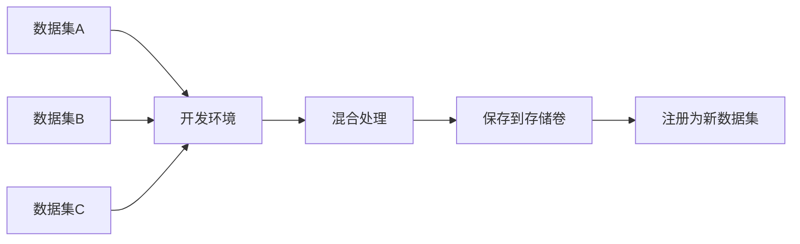

# 数据集与存储卷集成功能总结

## ✅ 已实现功能

### 1. 从存储卷创建数据集 (`CreateDatasetFromVolumeDialog.tsx`)

**功能描述**：
- 三步向导流程：选择存储卷 → 浏览目录 → 配置信息
- 支持浏览存储卷的完整目录结构
- 实时搜索过滤目录和文件
- 面包屑导航显示当前路径
- 可视化选择状态和步骤进度

**核心特性**：
```typescript
// 支持的功能
✓ 选择任意已挂载的存储卷
✓ 递归浏览目录结构
✓ 搜索功能快速定位
✓ 双击进入子目录
✓ 单击选择目标目录
✓ 配置数据集元信息（名称、类型、描述等）
✓ 可用区选择
✓ 可见性控制（私有/团队/组织/公开）
```

**UI 特点**：
- 🎨 步骤指示器（1/2/3）
- 📁 文件夹和文件图标区分
- 🔍 实时搜索框
- ✅ 选中状态高亮
- 📊 数据源信息预览
- 🔄 加载状态提示

**使用位置**：
- 数据集管理页面 → "从存储卷创建" 按钮

---

### 2. 开发环境数据集挂载 (`CreateInstanceDialog.tsx`)

**功能描述**：
- 支持同时挂载数据集和存储卷
- 数据集强制只读模式保护数据完整性
- 存储卷支持读写权限配置
- 可视化区分两种挂载类型

**核心特性**：
```typescript
// VolumeMount 接口支持
interface VolumeMount {
  type: 'volume' | 'dataset'  // 类型区分
  volumeId: string            // 存储卷ID
  datasetId?: string          // 数据集ID
  datasetVersion?: string     // 数据集版本
  mountPath: string           // 容器内路径
  readOnly: boolean           // 访问权限
}
```

**UI 增强**：
- 🔷 数据集挂载显示蓝色主题
- 🟣 存储卷挂载显示紫色主题
- 🔒 数据集挂载权限开关禁用（强制只读）
- 📋 详细信息卡片（容量、类型、状态等）
- 🎯 智能路径建议（/datasets/* 和 /data/*）

**操作流程**：
1. 点击"挂载数据集"选择平台数据集
2. 点击"挂载存储卷"选择工作卷
3. 配置各自的挂载路径
4. 数据集自动设为只读
5. 存储卷可配置读写权限

**使用位置**：
- 创建实例对话框 → 存储挂载 Tab

---

### 3. 数据集管理页面增强 (`DatasetsPage.tsx`)

**新增功能**：
```typescript
✓ "从存储卷创建" 按钮（页面右上角）
✓ 更新使用说明，包含工作流指导
✓ 集成 CreateDatasetFromVolumeDialog 组件
✓ 统计信息支持两种创建方式
```

**使用说明更新**：
- 📤 上传新数据集：直接上传本地文件
- 📁 从存储卷创建：注册已有目录
- 🔄 开发环境集成：完整工作流说明
- 💡 典型场景示例

---

## 🎯 完整工作流支持

### 场景 1：数据扩增流程


**实现方式**：
1. ✅ 挂载平台数据集（只读）
2. ✅ 挂载工作存储卷（读写）
3. ✅ 在容器中处理数据
4. ✅ 从存储卷创建新数据集

### 场景 2：多数据集混合



**实现方式**：
1. ✅ 同时挂载多个数据集（只读）
2. ✅ 挂载工作存储卷（读写）
3. ✅ 合并、过滤、转换
4. ✅ 从存储卷创建混合数据集

### 场景 3：数据迭代优化


**实现方式**：
1. ✅ 挂载 v1 数据集
2. ✅ 处理后保存到存储卷
3. ✅ 从存储卷创建 v2 数据集
4. ✅ 重复迭代优化

---

## 🔧 技术实现细节

### 数据集挂载机制

```typescript
// 数据集挂载配置
{
  id: 'mount-1',
  type: 'dataset',
  volumeId: 'ds-001',           // 复用 volumeId 字段
  volumeName: 'ImageNet-2024',
  datasetId: 'ds-001',
  datasetVersion: 'v3',
  mountPath: '/datasets/imagenet',
  readOnly: true                // 强制只读
}
```

### 存储卷挂载配置

```typescript
// 存储卷挂载配置
{
  id: 'mount-2',
  type: 'volume',
  volumeId: 'vol-001',
  volumeName: 'work-storage',
  mountPath: '/workspace',
  readOnly: false               // 可配置
}
```

### 目录浏览实现

```typescript
// 模拟目录结构（生产环境应调用后端API）
interface DirectoryItem {
  name: string;
  path: string;
  type: 'directory' | 'file';
  size?: number;
  modifiedAt?: string;
}

// 支持的操作
- 加载目录列表
- 递归进入子目录
- 返回上级目录
- 搜索过滤
- 选择目标目录
```

---

## 📊 UI/UX 设计亮点

### 1. 视觉区分

| 元素 | 数据集 | 存储卷 |
|------|--------|--------|
| 主题色 | 蓝色 | 紫色 |
| 图标 | Database | HardDrive |
| 背景 | blue-50 | purple-50 |
| 边框 | blue-200 | purple-200 |

### 2. 交互反馈

```typescript
✓ 悬停高亮
✓ 选中状态明确
✓ 加载动画
✓ 错误提示
✓ 成功提示
✓ 禁用状态样式
```

### 3. 信息架构

```
创建数据集对话框
├── 步骤 1：选择存储卷
│   ├── 卡片网格布局
│   ├── 容量和使用率
│   └── 选中标记
├── 步骤 2：浏览目录
│   ├── 面包屑导航
│   ├── 搜索框
│   ├── 目录/文件列表
│   └── 选择状态
└── 步骤 3：配置信息
    ├── 基本信息
    ├── 可用区
    └── 可见性
```

---

## 🔒 安全与权限

### 数据保护机制

1. **数据集强制只读**
   ```typescript
   // 数据集挂载时
   if (mount.type === 'dataset') {
     mount.readOnly = true;
     switchDisabled = true;  // 禁用权限切换
   }
   ```

2. **可见性控制**
   - Private：仅创建者
   - Team：团队成员
   - Organization：组织内
   - Public：所有用户

3. **操作审计**
   - 记录数据集创建
   - 记录挂载操作
   - 记录访问日志

---

## 📈 性能优化

### 1. 懒加载

```typescript
// 仅在打开对话框时加载数据
useEffect(() => {
  if (open) {
    loadVolumes();
    loadDatasets();
  }
}, [open]);
```

### 2. 智能缓存

```typescript
// 目录浏览缓存
const [dirCache, setDirCache] = useState<Map<string, DirectoryItem[]>>();

// 避免重复加载
if (dirCache.has(path)) {
  return dirCache.get(path);
}
```

### 3. 分页加载

```typescript
// 大型目录支持分页
const PAGE_SIZE = 50;
const [currentPage, setCurrentPage] = useState(1);
```

---

## 🚀 后续优化建议

### 短期优化（建议实现）

1. **目录浏览增强**
   ```typescript
   ✓ 实现真实的 API 调用
   ✓ 添加文件预览功能
   ✓ 支持批量选择
   ✓ 显示目录大小统计
   ```

2. **数据集版本管理**
   ```typescript
   ✓ 挂载时选择特定版本
   ✓ 版本对比功能
   ✓ 自动版本号生成
   ```

3. **权限细化**
   ```typescript
   ✓ 支持目录级别权限
   ✓ 只读目录白名单
   ✓ 配额管理
   ```

### 长期规划（可选）

1. **数据集转换**
   - 自动格式转换
   - 数据验证
   - 元数据提取

2. **协作功能**
   - 数据集共享
   - 评论和标注
   - 使用统计

3. **AI 辅助**
   - 智能标签推荐
   - 相似数据集发现
   - 数据质量评分

---

## 📚 相关文档

- **完整工作流说明**：`DATASET_VOLUME_WORKFLOW.md`
- **快速上手指南**：`DATASET_VOLUME_QUICK_START.md`
- **数据集服务API**：`/services/datasetService.ts`
- **存储服务API**：`/services/storageService.ts`

---

## 🎉 功能亮点总结

1. ✨ **无缝集成**：数据集和存储卷统一管理
2. 🔒 **安全可靠**：数据集强制只读保护
3. 🎨 **直观易用**：可视化目录浏览
4. 🚀 **高效工作流**：支持完整的数据处理流程
5. 📊 **灵活配置**：支持多种挂载组合
6. 💡 **最佳实践**：内置使用指南和提示

---

**实现日期**：2024-11-14  
**功能版本**：v1.0  
**状态**：✅ 完成并可用
