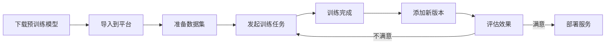

# 模型管理模块 - 快速开始

## 🎯 核心价值

模型管理模块为费米集群提供：
- 📦 **统一的模型资产管理** - 集中管理所有AI模型
- 🔄 **完整的版本控制** - 跟踪模型的每个版本
- 🚀 **无缝训练集成** - 一键发起微调训练
- 💾 **企业级存储** - 对象存储+元数据分离

## 📍 访问入口

在费米集群系统侧边栏中点击 **"模型管理"** 进入。

## 🎬 快速上手（5分钟）

### 1️⃣ 导入第一个模型（2分钟）

```
点击右上角 [+ 导入模型] 按钮
  ↓
填写模型信息：
  - 模型名称：Llama-3-8B（必填）
  - 模型类型：文本模型（下拉选择）
  - 模型文件：拖拽或点击上传 .zip/.tar/.pth 文件
  - 备注：Meta开源的大语言模型（可选）
  ↓
点击 [开始导入]
  ↓
等待上传完成（显示实时进度）
  ↓
✅ 导入成功！自动创建v1版本
```

### 2️⃣ 添加新版本（1分钟）

```
在模型列表找到刚才导入的模型
  ↓
点击 [+ 新增版本] 按钮
  ↓
系统自动建议版本号：v2（可修改）
  ↓
上传新的模型文件
  ↓
添加版本说明：例如"微调后的版本"
  ↓
点击 [添加版本]
  ↓
✅ 版本添加成功！
```

### 3️⃣ 发起训练任务（2分钟）

```
点击模型的 [查看详情] 按钮
  ↓
在版本列表中选择某个版本
  ↓
点击该版本的 [🚀] 发起训练按钮
  ↓
系统自动生成任务名称（可修改）
  ↓
选择训练数据集：
  - 系统会加载所有可用数据集
  - 显示数据集大小、记录数等信息
  ↓
点击 [创建训练任务]
  ↓
✅ 任务创建成功！跳转到训练任务页面
```

## 🎓 核心概念

### 模型（Model）
- **定义**：一个AI模型资产的抽象，可以有多个版本
- **类型**：文本模型、图像模型、通用文件
- **示例**：Llama-3-8B、BERT-Base-Chinese

### 版本（Version）
- **定义**：模型的一个具体实现，对应一个文件
- **版本号**：v1, v2, v2.1等，自由命名
- **状态**：上传中、就绪、失败

### 训练任务（Training Job）
- **定义**：使用模型+数据集进行微调的任务
- **输入**：基础模型版本 + 训练数据集
- **输出**：新的模型checkpoint（可作为新版本）

## 📚 使用场景

### 场景A：管理HuggingFace下载的模型

```
1. 从HuggingFace下载Llama-3-8B到本地
2. 打包成.zip文件
3. 通过"导入模型"上传到平台
4. 模型文件自动存储到对象存储
5. 可随时下载或用于训练
```

### 场景B：训练模型微调版本

```
1. 已有基础模型：BERT-Base-Chinese v1
2. 准备了金融领域数据集
3. 从v1发起训练任务
4. 训练完成后得到checkpoint
5. 将checkpoint作为v2上传到平台
6. 对比v1和v2的效果
```

### 场景C：模型版本管理

```
1. 基础模型：GPT-2（v1）
2. 在通用语料上微调：GPT-2-General（v2）
3. 在医疗数据上微调：GPT-2-Medical（v3）
4. 在法律数据上微调：GPT-2-Legal（v4）
5. 所有版本统一管理，随时切换使用
```

## 🔥 高级功能

### 大文件上传
- **分片上传**：自动将大文件（GB级）分成5MB的chunk
- **断点续传**：网络中断后可继续上传（接口已预留）
- **实时进度**：显示百分比和上传速度

### 智能版本建议
- 系统自动分析已有版本号
- 建议下一个版本号（v1→v2→v3）
- 检测版本号重复

### 数据集智能匹配
- 发起训练时显示所有可用数据集
- 按状态筛选（只显示ready状态）
- 显示详细信息帮助选择

## ⚠️ 注意事项

### 删除保护
- ✅ 可以删除模型（会删除所有版本）
- ✅ 可以删除版本（需确认）
- ❌ 不能删除模型的最后一个版本

### 文件格式
支持的格式：
- `.zip` - 推荐，通用压缩包
- `.tar`, `.tar.gz` - Linux常用格式
- `.pth`, `.pt` - PyTorch模型
- `.ckpt` - Checkpoint文件
- `.safetensors` - 安全张量格式

### 存储位置
- **元数据**：存储在数据库（名称、类型、版本号等）
- **文件**：存储在对象存储S3/MinIO（不占用数据库空间）
- **路径格式**：`s3://models/{model-name}/{version}.zip`

## 🛠️ 集成到工作流

### 典型的模型训练流程



### 与其他模块的关系

```
模型管理模块
    ↓ 提供模型
训练任务模块
    ↓ 使用模型
推理服务模块（V1.1）
```

## 💡 最佳实践

### 1. 命名规范
```
模型名称：{架构}-{规模}-{特性}
示例：Llama-3-8B, BERT-Base-Chinese

版本号：v{major}.{minor}
示例：v1.0, v2.1, v3.0
或：v1_base, v2_finetuned, v3_medical
```

### 2. 版本说明
```
好的说明：
✅ "在1M中文对话数据上微调，loss降至0.32"
✅ "修复了tokenizer的bug，提升了推理速度"
✅ "使用LoRA方法微调，参数量减少50%"

差的说明：
❌ "新版本"
❌ "test"
❌ ""（空）
```

### 3. 文件准备
```
推荐打包方式：
1. 将模型文件放在一个目录中
2. 包含必要的配置文件（config.json等）
3. 压缩成.zip格式
4. 文件大小控制在10GB以内（单次上传）

目录结构示例：
llama-3-8b/
  ├── config.json
  ├── pytorch_model.bin
  ├── tokenizer.json
  └── tokenizer_config.json
```

## 📊 查看统计

页面顶部的统计卡片实时显示：
- 📦 全部模型数量
- 📝 文本模型数量
- 🖼️ 图像模型数量
- 📁 通用文件数量

## 🔍 搜索技巧

搜索框支持：
- 模型名称搜索：输入"BERT"查找所有BERT模型
- 类型搜索：输入"text"查找所有文本模型
- 实时过滤：输入即搜索

## 🎯 V1.0 vs V1.1

### V1.0（当前版本）包含：
- ✅ 模型CRUD操作
- ✅ 版本管理
- ✅ 文件上传/下载
- ✅ 发起训练任务

### V1.1（规划中）将增加：
- 🔜 模型一键部署为推理服务
- 🔜 训练完成自动创建新版本
- 🔜 模型效果评估和对比
- 🔜 模型市场/共享功能

## 🆘 常见问题

**Q: 上传速度慢怎么办？**
A: 系统使用分片上传，会自动处理大文件。建议在网络良好时上传。

**Q: 可以删除正在使用的模型吗？**
A: 可以删除，但建议先确认没有正在运行的训练任务使用该模型。

**Q: 模型文件存储在哪里？**
A: 存储在对象存储（S3/MinIO）中，不占用数据库空间。

**Q: 如何知道哪个版本效果最好？**
A: V1.0暂不支持自动评估，建议在版本备注中记录关键指标。

**Q: 可以分享模型给其他用户吗？**
A: V1.0暂不支持，V1.1将增加权限控制和共享功能。

## 📞 技术支持

遇到问题？
- 查看详细文档：`/MODEL_MANAGEMENT_MODULE.md`
- 查看功能清单：`/MODEL_MODULE_CHECKLIST.md`
- 联系平台管理员

---

🎉 恭喜！你已经掌握了模型管理模块的基本使用方法。
现在就开始导入你的第一个模型吧！
