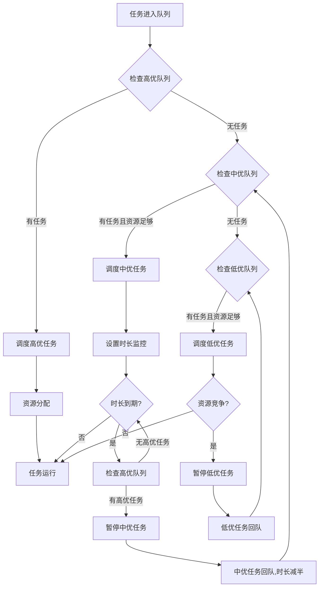

# 费米集群 - 资源调度与AI工作负载业务流程说明

## 📋 业务流程概览

```
用户创建任务 → 选择队列 → 任务排队 → 调度器分配 → 资源运行 → 监控管理 → 任务完成
```

## 🔄 完整业务流程

### 1. 任务创建阶段（AI工作负载模块）

用户在以下模块创建工作负载时，会自动关联到资源调度系统：

#### 📱 **开发环境** (`/instances`)
- **场景**：创建Jupyter Lab、VS Code Server等交互式开发容器
- **配置项**：
  - 基础配置：环境名称、IDE类型、镜像地址
  - **资源与调度**（关键）：
    - 选择可用区和资源池
    - 选择任务队列（高/中/低优先级队列）
    - 设置队列优先级（high/medium/low）
    - 是否可抢占
  - 资源配置：GPU数量/型号、CPU、内存
  - 高级配置：挂载卷、环境变量
- **提交后**：
  - 自动创建计算任务（taskId）
  - 任务进入选定的队列排队
  - 显示排队位置和预计等待时间

#### 🎯 **训练任务** (`/training-jobs`)
- **场景**：DDP分布式训练、模型训练作业
- **配置项**：
  - 训练配置：任务名称、训练框架、模型路径
  - **调度配置**：
    - 任务队列选择
    - 优先级设置
    - 实例数（分布式训练）
  - 资源配置：GPU数量、CPU、内存
  - 训练参数：epochs、batch_size等
- **特性**：
  - 支持TensorBoard可视化
  - 自动检查点保存
  - 失败重试机制

#### ⚡ **推理服务** (`/inference-services`)
- **场景**：vLLM推理、在线API服务
- **配置项**：
  - 服务配置：服务名称、模型路径、API端口
  - **调度配置**：
    - 队列和优先级
    - 实例数（负载均衡）
  - 资源配置：GPU数量、CPU、内存
  - 推理参数：max_tokens、temperature等
- **特性**：
  - 自动Ingress配置
  - 健康检查
  - 弹性扩缩容

---

### 2. 队列管理阶段（任务队列模块）

#### 📊 **任务队列** (`/task-queues`)

##### **队列类型**
- **默认队列（Default）**：通用任务调度
- **Volcano队列**：专为AI训练优化的调度器

##### **优先级规则**

**🔴 高优先级队列**
- **调度策略**：立即优先调度
- **资源保障**：满足资源需求直到任务结束
- **适用场景**：
  - 紧急实验任务
  - 重要生产服务
  - SLA保障任务
- **特点**：不会被抢占，始终优先获取资源

**🟠 中优先级队列**
- **调度策略**：需设置预期使用时长
- **资源保障**：在预期时长内保障资源
- **抢占规则**：
  - 超过预期时长后，可能被高优任务抢占
  - 重新排队后，时长减半
  - 循环调度直到完成
- **适用场景**：
  - 常规训练任务
  - 开发测试环境
  - 批量实验任务

**🔵 低优先级队列**
- **调度策略**：资源充足时运行
- **资源保障**：无时长保障
- **抢占规则**：
  - 发生资源竞争时立即暂停
  - 任务重新回队等待
  - 高中优任务无需求且资源足够时重新调度
- **适用场景**：
  - 低优先级批处理
  - 离线数据处理
  - 成本敏感型任务

##### **调度策略**

**FIFO（先进先出）**
```
任务按提交时间顺序调度
适合：短作业、公平调度场景
```

**DRF（主资源公平）**
```
根据CPU、GPU等资源使用情况均衡分配
适合：多资源类型混合调度
智能均衡CPU密集型和GPU密集型任务
```

**Backfill（回填）**
```
在不影响排队任务的前提下，优先调度小任务填充碎片资源
适合：提高资源利用率
混合大小任务场景
```

---

### 3. 任务调度阶段（系统自动）

#### 🤖 调度器工作流程



#### 📡 K8s Informer监听

系统通过Kubernetes Informer机制实时监听：
- Pod创建、调度、运行状态
- 资源使用情况
- 节点状态变化
- 调度事件和日志

---

### 4. 任务运行阶段（计算任务模块）

#### 💻 **计算任务** (`/compute-tasks`)

##### **任务列表展示**
- 任务ID、名称、类型（开发/训练/推理/微调）
- 状态：pending（排队）、running（运行）、completed（完成）、failed（失败）
- 队列信息：队列名称、优先级
- 资源配置：GPU型号/数量、CPU、内存
- 位置信息：可用区、资源池、节点名称
- 计费信息：小时单价、累计费用

##### **任务来源追溯**
每个计算任务都标记来源：
- 开发环境（development）
- 训练任务（training）
- 推理服务（inference）
- 微调任务（fine-tuning）

##### **操作功能**
- 查看详情：完整配置信息
- 查看日志：实时容器日志
- Web Console：终端连接
- 查看监控：跳转到监控页面
- 停止任务：终止运行中的任务
- 删除任务：清理已停止的任务

---

### 5. 监控管理阶段（任务监控模块）

#### 📊 **任务监控** (`/task-monitoring/:taskId`)

##### **容器组（Pods）监控**
- Pod状态：Running/Pending/Failed
- 实时资源使用：
  - CPU使用率（2.5/8 cores）
  - 内存使用率（18.3/32 GB）
  - GPU使用率（87%，35.2/40 GB）
- Pod信息：IP地址、节点名称、重启次数
- **操作**：
  - 查看实时日志
  - Web Console连接
  - 新增端口映射

##### **Service监控**
- 服务类型：ClusterIP/NodePort/LoadBalancer
- Cluster IP地址
- 端口映射：服务端口 → 目标端口 → 节点端口
- Selector标签

##### **Ingress监控**
- 外部访问域名和路径
- TLS配置状态
- 后端服务映射
- 一键跳转外部链接

##### **Secret管理**
- Secret类型
- 数据键列表
- 创建时间

---

## 🔗 业务流程串联点

### 从AI工作负载到计算任务

#### 1️⃣ **开发环境 → 计算任务**
```typescript
// 开发环境页面
<Button onClick={() => handleViewTask(instance)}>
  <Activity />
  查看任务监控
</Button>

// 跳转到任务监控
navigate(`/task-monitoring/${instance.taskId}`);
```

#### 2️⃣ **显示队列信息**
```tsx
// 在开发环境卡片中显示调度信息
<div className="p-4 bg-purple-50 rounded-lg">
  <div className="flex items-center gap-2">
    <List className="w-4 h-4 text-purple-600" />
    <span>调度队列</span>
  </div>
  <p>{instance.queueName}</p>
  {instance.queuePosition && (
    <p className="text-orange-600">
      排队位置: 第 {instance.queuePosition} 位
    </p>
  )}
</div>
```

#### 3️⃣ **状态同步**
- 任务状态实时更新
- 排队位置动态显示
- 资源使用率监控

#### 4️⃣ **快速导航**
```tsx
// 流程说明卡片
<Alert>
  <span>创建开发环境</span>
  <ArrowRight />
  <span>选择任务队列</span>
  <ArrowRight />
  <span>排队调度</span>
  <ArrowRight />
  <span>资源分配</span>
  <ArrowRight />
  <span>启动运行</span>
  <Button onClick={handleViewQueue}>
    查看队列管理 <ExternalLink />
  </Button>
</Alert>
```

---

## 📈 用户操作路径示例

### 场景1：创建PyTorch开发环境

1. **进入开发环境页面** (`/instances`)
2. **点击"创建开发环境"**
3. **填写基础配置**
   - 环境名称：PyTorch开发环境
   - IDE类型：Jupyter Lab
   - 镜像：jupyter/pytorch-notebook:latest
4. **配置资源与调度** ⭐
   - 可用区：华北1区-A
   - 资源池：GPU-Pool-A
   - 任务队列：高优先级队列
   - 队列优先级：高优先级
   - GPU：1x NVIDIA A100
5. **点击"创建并提交"**
6. **系统提示**：✅ 开发环境已提交，正在排队调度...
7. **返回列表页**：
   - 显示状态：排队中
   - 显示队列：高优先级队列
   - 显示排队位置：第1位
8. **等待调度**（约30秒）
9. **状态变更**：排队中 → 启动中 → 运行中
10. **点击"打开IDE"**：访问Jupyter Lab
11. **点击"查看任务监控"**：查看资源使用情况

### 场景2：查看任务调度详情

1. **从开发环境列表** 点击 "查看任务监控"
2. **跳转到任务监控页面** (`/task-monitoring/task-dev-001`)
3. **查看Pods标签页**：
   - CPU使用：2.5/8 cores
   - 内存使用：18.3/32 GB
   - GPU使用：87% (35.2/40 GB)
4. **点击"查看日志"**：查看容器实时日志
5. **点击"Web Console"**：打开终端连接
6. **查看Service标签页**：查看端口映射
7. **查看Ingress标签页**：获取外部访问地址

### 场景3：队列管理员调整策略

1. **进入任务队列页面** (`/task-queues`)
2. **查看队列统计**：
   - 高优队列：5个排队，3个运行
   - 中优队列：12个排队，5个运行
   - 低优队列：28个排队，2个运行
3. **点击"编辑配置"**（中优队列）
4. **修改调度策略**：FIFO → DRF
5. **保存配置**
6. **系统自动应用新策略**

---

## 🎯 关键改进点

### ✅ 已实现

1. **队列信息展示**
   - 在开发环境列表中显示队列名称和优先级
   - 显示排队位置（pending状态）
   - 显示调度状态变化

2. **任务来源标记**
   - 计算任务页面显示任务类型（开发/训练/推理/微调）
   - 每个任务有taskId追溯

3. **跳转链接**
   - 开发环境 → 任务监控
   - 任务监控 → 返回计算任务列表
   - 流程说明 → 队列管理

4. **状态统一**
   - pending、running、stopped、failed等状态一致
   - 实时同步更新

5. **流程引导**
   - 创建页面添加流程说明卡片
   - 队列选择提示和说明
   - 优先级规则说明

### 🔄 业务流程完整性

- ✅ AI工作负载创建 → 自动生成计算任务
- ✅ 计算任务 → 关联队列信息
- ✅ 任务监控 → 展示K8s资源
- ✅ 队列管理 → 调度策略配置
- ✅ 全流程可追溯、可监控、可管理

---

## 📝 数据模型关联

```typescript
// 开发环境实例
interface Instance {
  id: string;                    // 实例ID
  taskId: string;                // 关联的计算任务ID ⭐
  queueName: string;             // 任务队列名称 ⭐
  queuePriority: QueuePriority;  // 队列优先级 ⭐
  queuePosition?: number;        // 排队位置 ⭐
  status: InstanceStatus;        // 状态同步 ⭐
  // ... 其他配置
}

// 计算任务
interface ComputeTask {
  id: string;                    // 任务ID
  type: TaskType;                // 任务类型（来源）⭐
  queueName: string;             // 队列名称
  priority: QueuePriority;       // 优先级
  status: TaskStatus;            // 状态
  // ... 其他信息
}

// 任务队列
interface TaskQueue {
  id: string;                    // 队列ID
  name: string;                  // 队列名称
  priority: QueuePriority;       // 队列优先级
  pendingTasks: number;          // 排队任务数
  runningTasks: number;          // 运行任务数
  scheduleStrategy: ScheduleStrategy; // 调度策略
  // ... 其他配置
}
```

---

## 🚀 后续优化方向

1. **实时WebSocket推送**
   - 队列位置实时更新
   - 任务状态变更通知
   - 资源使用告警

2. **智能调度建议**
   - 根据历史数据推荐队列
   - 预测排队时间
   - 成本优化建议

3. **批量操作**
   - 批量创建任务
   - 批量调整优先级
   - 批量停止/删除

4. **更详细的监控**
   - 任务执行时间线
   - 资源使用趋势图
   - 成本分析报表

---

## 📚 相关文档

- [任务队列管理文档](./docs/task-queues.md)
- [计算任务管理文档](./docs/compute-tasks.md)
- [调度策略说明](./docs/scheduling-strategies.md)
- [K8s集成文档](./docs/k8s-integration.md)
